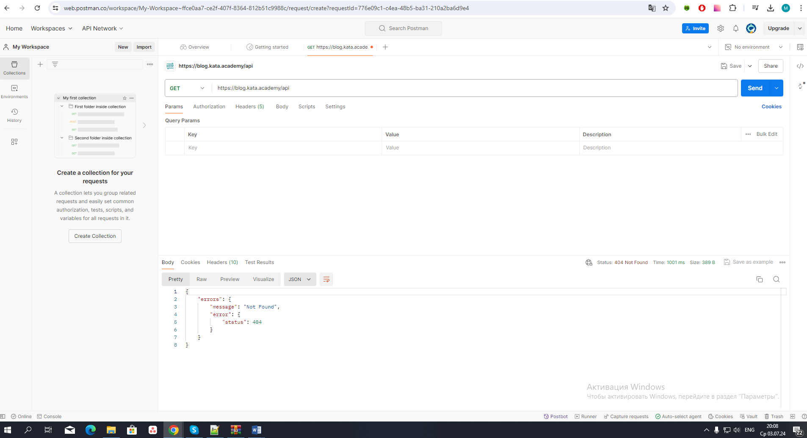
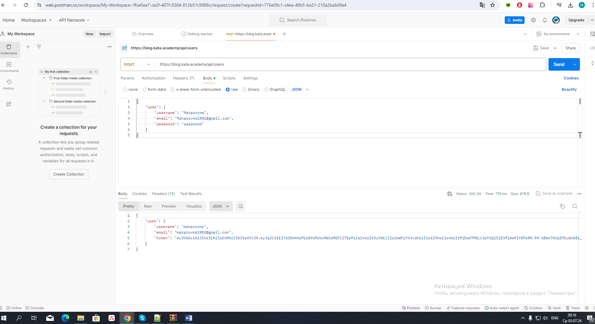
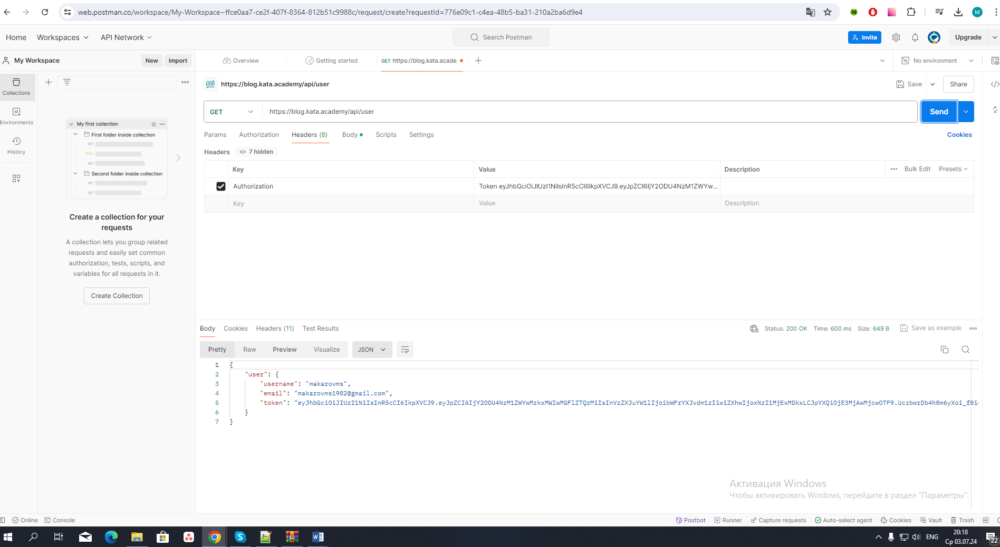
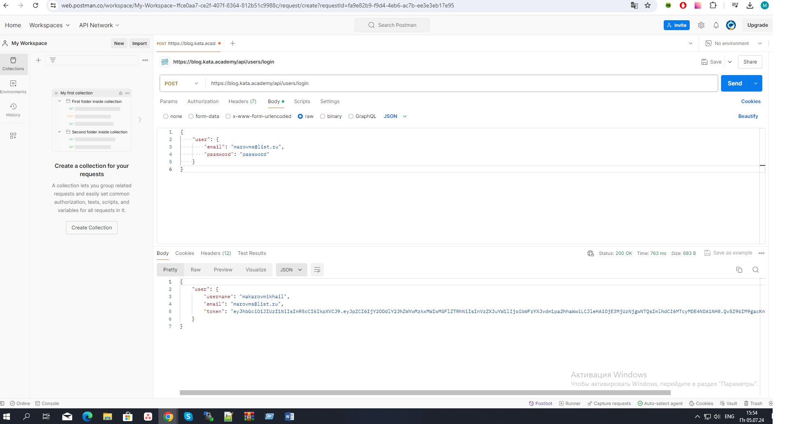

# Практическая задача 4.4.9 JS Core. Auth to API

1.	В поле "Enter" вводим базовый URL API - https://blog.kata.academy/api. Нажимаем кнопку "Send".
2.	В ответ получаем JSON с ошибкой, так как не указали endpoint для запроса.



3.	Открываем документацию API (https://api.realworld.io/api-docs/) и выбираем интересующий нас endpoint. Например, для регистрации это будет "POST /users"
4.	В поле "Enter request URL" вводим базовый URL API - https://blog.kata.academy/api/users. В выпадающем меню выбираем метод "POST".
5.	В разделе "Body" выбираем формат данных "JSON (application/json)".
6.	В поле для ввода данных в формате JSON вводим необходимые параметры для аутентификации пользователя, например:

```javascript
	{
	    "user": {
	        "username": "Makarovms",
	        "email": "Makarovms1982@gmail.com",
	        "password": "password"
	    }
	}
```

7.	Нажимаем кнопку "Send". В ответ получаем JSON с данными о залогиненном пользователе, включая токен авторизации.



8.	Для получения данных текущего пользователя выбираем в документации endpoint "GET /user"
9.	В поле "Enter request URL" вводим базовый URL API - https://blog.kata.academy/api/user. В выпадающем меню выбираем метод "GET".
10.	В разделе "Headers" добавляем новый заголовок с ключом "Authorization" и значением "Token <ваш_токен_авторизации>", полученным после успешной аутентификации.
11.	Нажимаем кнопку "Send". В ответ получаем JSON с данными о текущем пользователе.



12.	Для авторизации пользователя выбираем в документации endpoint "POST /users/login"
13.	В поле "Enter request URL" вводим базовый URL API - https://blog.kata.academy/api/users/login. В выпадающем меню выбираем метод "POST".
14.	В разделе "Body" выбираем формат данных "JSON (application/json)".
15.	В поле для ввода данных в формате JSON вводим необходимые параметры для аутентификации пользователя, например:
16.	
```javascript
	{
	    "user": {
	        "email": "makarovms@list.ru",
	        "password": "password"
	    }
	}
```

16.	Нажимаем кнопку "Send". В ответ получаем JSON с данными о текущем пользователе.

